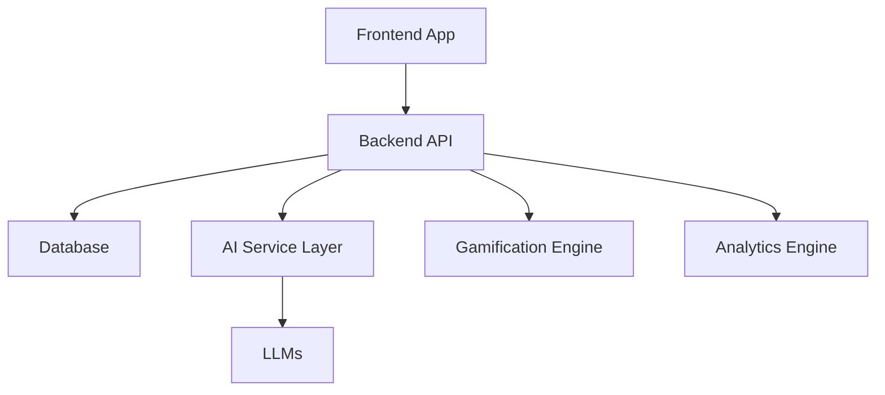
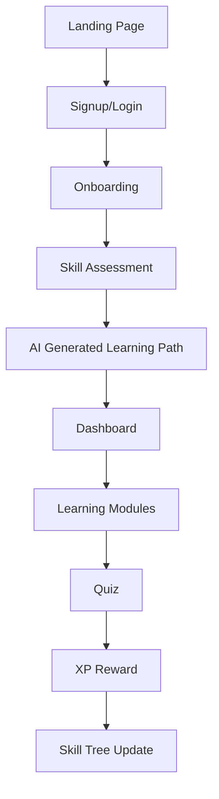
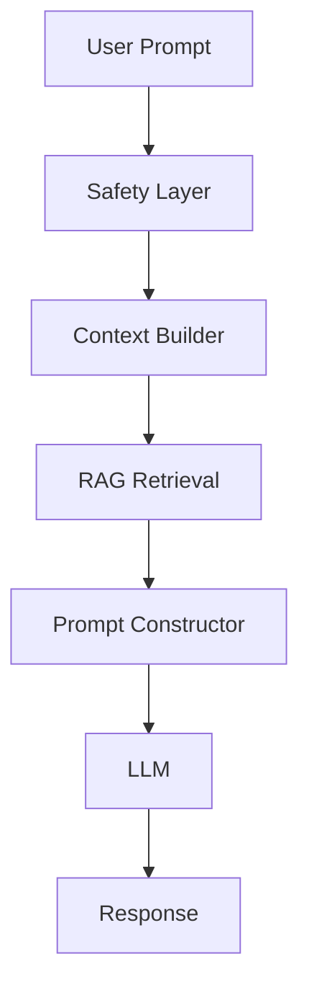
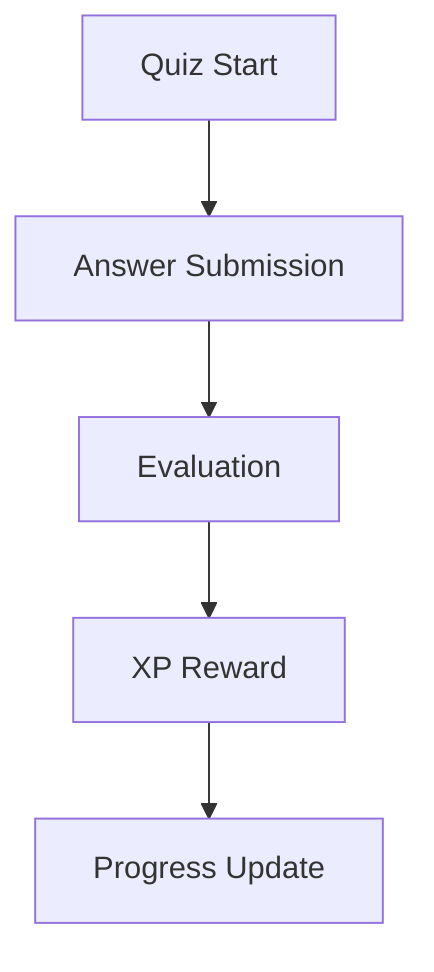
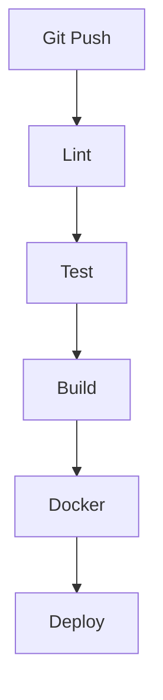
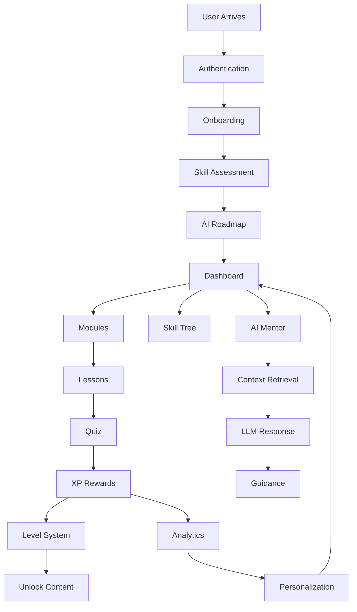

# AI PM Odyssey — LLM Optimized Blueprint

## Overview

AI PM Odyssey is a cyberpunk-themed, gamified learning platform for aspiring AI Product Managers.

The platform combines:
- Structured learning
- AI mentorship
- Skill trees
- Interactive simulations
- Gamification systems
- Personalized learning paths
- Practical AI PM workflows

---

# Core Product Goals

## Educational Goals
- Teach AI Product Management
- Provide hands-on exercises
- Simulate real-world AI product decisions
- Help users transition into AI PM careers

## Engagement Goals
- Increase retention
- Encourage daily learning
- Improve session duration
- Drive motivation through gamification

## Technical Goals
- Scalable architecture
- AI-native infrastructure
- Responsive UI
- Modular systems
- Real-time interactivity

---

# Recommended Tech Stack

## Frontend
- Next.js
- React
- TypeScript
- Tailwind CSS
- Framer Motion
- Zustand
- TanStack Query

## Backend
- FastAPI or NestJS
- REST APIs
- WebSockets
- Background workers

## Database
- PostgreSQL
- Redis
- Vector DB (Qdrant/Weaviate/Pinecone)

---

# High-Level Architecture



---

# User Journey



---

# Core Domains

## Authentication Domain
Responsibilities:
- Login
- Registration
- Sessions
- OAuth
- JWT

Endpoints:
- POST /auth/register
- POST /auth/login
- POST /auth/logout
- POST /auth/refresh

---

# User Domain

User Model:

```yaml
User:
  id
  username
  email
  avatar
  level
  xp
  streak
  achievements
  completedLessons
  unlockedSkills
```

---

# Content Domain

Hierarchy:

```text
Track
 └── Module
      └── Lesson
           └── Topic
                └── Quiz
```

Lesson Structure:
- Introduction
- Core Theory
- Examples
- Interactive Content
- Quiz
- Summary
- XP Reward

---

# Gamification Domain

## XP Sources

| Activity | XP |
|---|---|
| Lesson Completion | 50 |
| Quiz Pass | 25 |
| Daily Login | 10 |
| Boss Battle | 200 |

## Achievement Categories
- Consistency
- Mastery
- Exploration
- Social
- Secret

---

# Skill Tree System

Node States:
- Locked
- Available
- In Progress
- Mastered
- Elite

Requirements:
- Dependency graph
- XP thresholds
- AI recommendations
- Dynamic progression

---

# AI Mentor System

Mentor Name:
Nova

Responsibilities:
- Explain concepts
- Generate analogies
- Recommend lessons
- Generate quizzes
- Detect weaknesses

AI Pipeline:



---

# Quiz Engine

Supported Types:
- Multiple Choice
- Drag and Drop
- Fill in the Blank
- Code Challenges
- Boss Battles

Quiz Flow:



---

# Personalization Engine

Inputs:
- Goals
- Weaknesses
- Learning speed
- Interests
- Time availability

Outputs:
- Recommended lessons
- Review reminders
- AI-generated roadmap

---

# Frontend Structure

```text
src/
 ├── app/
 ├── components/
 ├── features/
 ├── services/
 ├── hooks/
 ├── store/
 ├── styles/
 └── utils/
```

---

# Backend Structure

```text
backend/
 ├── auth/
 ├── users/
 ├── lessons/
 ├── quizzes/
 ├── AI/
 ├── gamification/
 ├── analytics/
 └── notifications/
```

---

# Database Tables

| Table | Purpose |
|---|---|
| users | User accounts |
| lessons | Educational content |
| quizzes | Quiz definitions |
| achievements | Achievement system |
| user_progress | Learning progress |
| AI_conversations | Mentor history |

---

# Performance Requirements

Frontend:
- Lighthouse > 90
- TTI < 2s
- 60 FPS animations

Backend:
- API response < 200ms
- AI response start < 2s

---

# Security Requirements

Must Implement:
- JWT rotation
- CSRF protection
- Prompt injection defense
- Input validation
- Rate limiting
- Abuse detection

---

# Accessibility Requirements

Support:
- Keyboard navigation
- Screen readers
- Reduced motion
- WCAG 2.1 AA

---

# CI/CD Flow



---

# Development Phases

## Phase 1 — MVP
- Authentication
- Dashboard
- Lessons
- Quiz engine
- AI mentor

## Phase 2 — Engagement
- Achievements
- Skill tree
- Daily streaks
- AI personalization

## Phase 3 — Scale
- Community
- Monetization
- Enterprise features

---

# Complete Platform Flow



---

# Final Product Vision

The final platform should feel like:
- Duolingo for AI PMs
- Combined with a cyberpunk RPG
- Enhanced by AI mentorship
- Focused on real-world AI product skills

The experience should:
- Feel immersive
- Encourage daily learning
- Continuously adapt to the user
- Reward progress consistently
