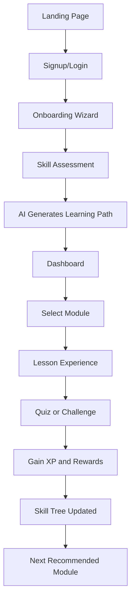
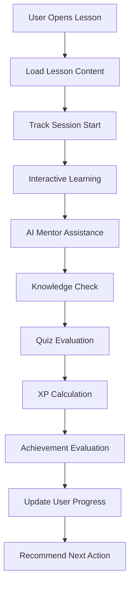
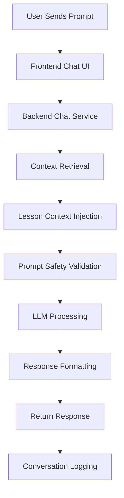
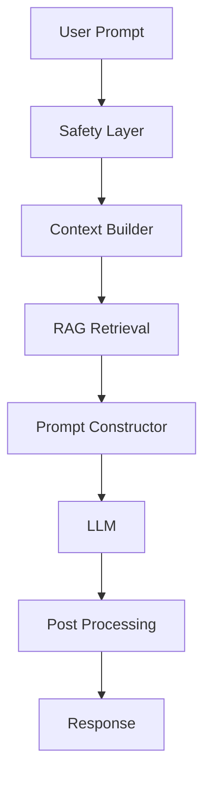
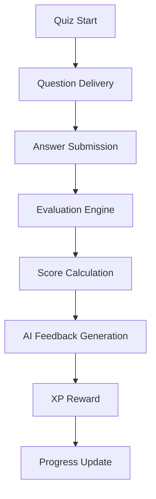
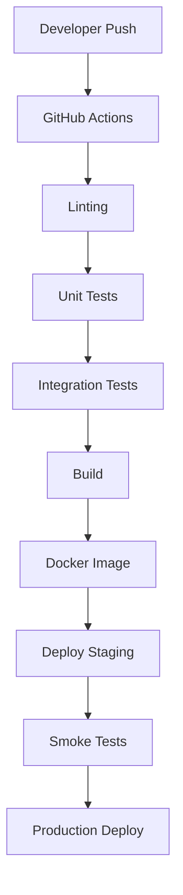
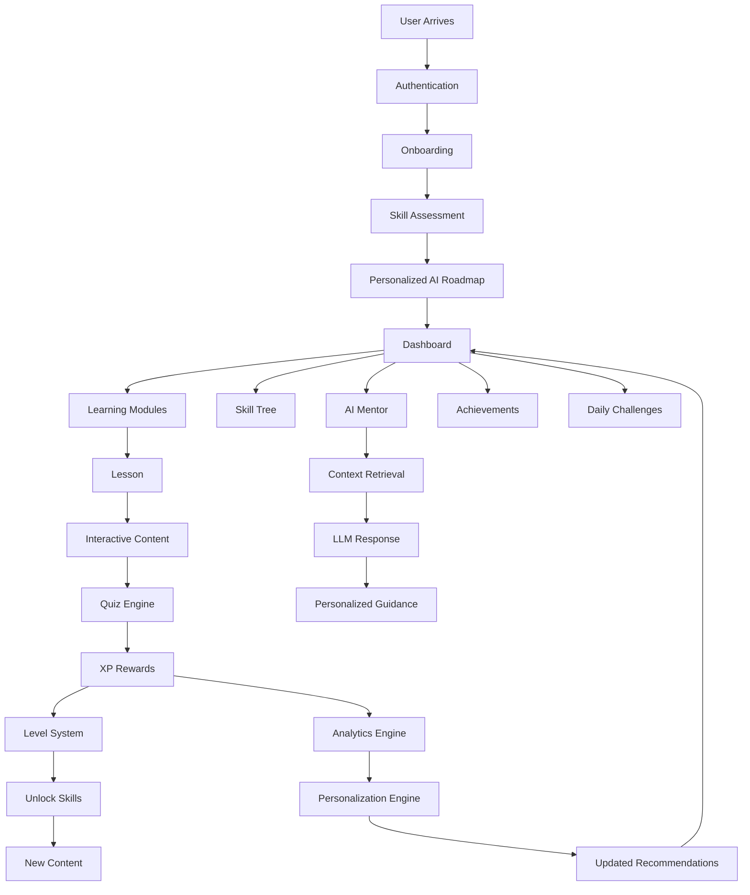

# AI PM Odyssey — LLM-Optimized System Blueprint

> Source project specification expanded and restructured for AI-agent readability, autonomous planning, task decomposition, implementation sequencing, and engineering execution. Based on the original TODO specification. fileciteturn0file0

---

# 1. PROJECT OVERVIEW

## 1.1 Product Vision

AI PM Odyssey is a:

* Cyberpunk-themed
* Gamified
* AI-native
* Personalized
* Interactive
  learning platform designed to help aspiring AI Product Managers learn:
* AI fundamentals
* LLMs
* Product management
* AI systems
* AI UX
* AI business strategy
* Technical implementation
* Agentic workflows

The platform combines:

* Structured learning
* Gamification systems
* AI mentorship
* Adaptive learning paths
* Interactive simulations
* Practical projects
* Real-world AI PM workflows

The core philosophy:

> Learn AI Product Management through immersion, progression systems, simulations, and AI-assisted exploration.

---

# 2. PRIMARY PRODUCT GOALS

## 2.1 Educational Goals

The platform should:

* Teach modern AI PM skills
* Provide hands-on practical exercises
* Simulate real-world AI product decisions
* Help users transition into AI PM careers
* Create portfolio-worthy outputs
* Personalize learning paths

## 2.2 Engagement Goals

The platform should maximize:

* Daily active usage
* Learning consistency
* Session duration
* Motivation through gamification
* Social sharing
* Retention

## 2.3 Technical Goals

The system should:

* Be scalable
* Support AI integrations
* Support real-time interactivity
* Work across mobile and desktop
* Provide low-latency UX
* Support modular feature expansion

---

# 3. HIGH-LEVEL SYSTEM ARCHITECTURE

## 3.1 Core System Components

The system contains the following major domains:

| Domain                    | Responsibility                        |
| ------------------------- | ------------------------------------- |
| Frontend Application      | User interface and interactions       |
| Backend API               | Business logic and orchestration      |
| Authentication Service    | Login, sessions, permissions          |
| AI Service Layer          | LLM calls, quiz generation, mentor AI |
| Content Management System | Lesson/module management              |
| Gamification Engine       | XP, achievements, streaks             |
| Analytics Engine          | User tracking and personalization     |
| Notification System       | Push/email/in-app notifications       |
| Database Layer            | Persistent storage                    |
| Cache Layer               | Performance optimization              |

---

# 4. RECOMMENDED TECH STACK

## 4.1 Frontend

### Primary Recommendation

* React + TypeScript
* Next.js (App Router)
* Tailwind CSS
* Framer Motion
* React Query / TanStack Query
* Zustand for lightweight state management

### Why

* Excellent ecosystem
* Fast iteration
* SSR/SSG support
* AI tooling compatibility
* Strong animation support
* Easy component architecture

---

## 4.2 Backend

### Primary Recommendation

* FastAPI OR Node.js with NestJS

### Suggested Choice

Use:

* FastAPI for AI-heavy workflows
* NestJS if prioritizing enterprise TypeScript consistency

### Required Capabilities

Backend must support:

* REST APIs
* WebSockets
* Background jobs
* AI orchestration
* Authentication
* Rate limiting
* Event-driven systems

---

## 4.3 Database Layer

### Primary Database

PostgreSQL

### Why

* Strong relational modeling
* Better analytics
* Mature indexing
* Structured learning data fits relational models

### Secondary Systems

| System                | Purpose                      |
| --------------------- | ---------------------------- |
| Redis                 | Cache + sessions + queues    |
| S3-compatible storage | Assets                       |
| Vector DB             | Embeddings + semantic search |

Recommended vector DBs:

* Qdrant
* Weaviate
* Pinecone

---

# 5. CORE USER FLOWS

## 5.1 New User Journey



---

## 5.2 Learning Session Flow



---

## 5.3 AI Mentor Interaction Flow



---

# 6. DOMAIN-DRIVEN FEATURE BREAKDOWN

# 6A. AUTHENTICATION DOMAIN

## Responsibilities

* Registration
* Login
* Session handling
* Permissions
* Security
* OAuth

## Features

### Required

* Email/password auth
* Google OAuth
* JWT authentication
* Refresh tokens
* Password reset
* Email verification

### Optional

* GitHub login
* Discord login
* Web3 wallet auth

## Backend Requirements

### API Endpoints

| Endpoint                   | Purpose        |
| -------------------------- | -------------- |
| POST /auth/register        | Create account |
| POST /auth/login           | Login          |
| POST /auth/logout          | Logout         |
| POST /auth/refresh         | Refresh token  |
| POST /auth/forgot-password | Reset flow     |
| GET /auth/me               | Current user   |

---

# 6B. USER PROFILE DOMAIN

## Responsibilities

* User identity
* Progress tracking
* Preferences
* Gamification stats
* Learning personalization

## User Data Model

```yaml
User:
  id
  username
  email
  avatar
  level
  xp
  streak
  achievements
  completedLessons
  unlockedSkills
  preferredTopics
  onboardingAnswers
  AIProfile
  createdAt
  updatedAt
```

---

# 6C. CONTENT DOMAIN

## Content Hierarchy

```text
Track
 └── Module
      └── Lesson
           └── Topic
                └── Quiz
                     └── Challenge
```

---

## Lesson Structure

Each lesson should contain:

| Section                | Description             |
| ---------------------- | ----------------------- |
| Introduction           | Learning objectives     |
| Core Theory            | Educational content     |
| Examples               | Real-world examples     |
| Interactive Components | Simulations/playgrounds |
| Knowledge Checks       | Mini quizzes            |
| Summary                | Recap                   |
| Final Quiz             | Graded assessment       |
| XP Reward              | Progression value       |

---

## Content Metadata

Each lesson requires:

```yaml
Lesson:
  id
  title
  description
  difficulty
  estimatedTime
  prerequisites
  tags
  XPReward
  contentBlocks
  quizzes
  status
  version
```

---

# 6D. GAMIFICATION DOMAIN

## Responsibilities

* XP systems
* Levels
* Achievements
* Rewards
* Streaks
* Progression
* Motivation loops

---

## XP System Design

### XP Sources

| Activity               | XP       |
| ---------------------- | -------- |
| Lesson Completion      | 50       |
| Quiz Pass              | 25       |
| Perfect Quiz           | 50 bonus |
| Daily Login            | 10       |
| Streak Milestone       | Variable |
| Boss Battle            | 200      |
| Community Contribution | Variable |

---

## Level Formula

Suggested formula:

```text
XP Needed = BaseXP * (Level ^ GrowthFactor)
```

Suggested values:

* BaseXP = 100
* GrowthFactor = 1.5

---

## Achievement Categories

| Category    | Example                  |
| ----------- | ------------------------ |
| Consistency | 30-day streak            |
| Mastery     | Complete all LLM lessons |
| Exploration | Visit every module       |
| Perfection  | 100% quiz score          |
| Social      | Share achievements       |
| Secret      | Hidden easter eggs       |

---

# 6E. SKILL TREE DOMAIN

## Purpose

Visual representation of:

* Learning progression
* Dependencies
* Specializations
* Career pathways

---

## Skill Node States

| State       | Description         |
| ----------- | ------------------- |
| Locked      | Prerequisites unmet |
| Available   | Can begin           |
| In Progress | User started        |
| Mastered    | Completed           |
| Elite       | Advanced mastery    |

---

## Skill Tree Rules

### Requirements

* Nodes may depend on other nodes
* XP thresholds unlock branches
* AI recommends optimal paths
* Users can override recommendations

---

## Skill Tree Rendering Requirements

### Must Support

* Zoom
* Pan
* Dynamic node updates
* Animated transitions
* Mobile fallback mode

---

# 6F. AI MENTOR DOMAIN

## AI Mentor Persona

### Name

Nova

### Personality

* Friendly
* Encouraging
* Technical but accessible
* Curious
* Slightly cyberpunk-themed

---

## AI Mentor Responsibilities

The mentor should:

* Explain concepts
* Simplify technical topics
* Generate analogies
* Answer contextual questions
* Recommend lessons
* Generate quizzes
* Analyze user weaknesses

---

## AI Mentor Context Sources

The AI should use:

* Current lesson
* User progress
* Skill tree state
* Quiz history
* Recent conversations
* Learning preferences

---

## LLM Architecture

### Suggested Pipeline



---

## AI Safety Requirements

### Must Implement

* Prompt injection defense
* Toxicity filtering
* Rate limiting
* Cost controls
* Abuse detection
* Hallucination mitigation

---

# 6G. QUIZ ENGINE DOMAIN

## Supported Quiz Types

| Type              | Description            |
| ----------------- | ---------------------- |
| Multiple Choice   | Standard questions     |
| Fill in the Blank | Text answers           |
| Drag and Drop     | Ordering/ranking       |
| Code Completion   | Technical exercises    |
| Scenario Analysis | PM decision-making     |
| Boss Battles      | Timed advanced quizzes |

---

## Quiz Evaluation Flow



---

# 6H. PERSONALIZATION ENGINE

## Purpose

Adapt platform experience based on:

* User goals
* Performance
* Interests
* Time availability
* Weaknesses

---

## Inputs

| Input              | Example         |
| ------------------ | --------------- |
| Goal               | Become AI PM    |
| Time Availability  | 5 hours/week    |
| Preferred Topics   | LLMs            |
| Weak Areas         | SQL             |
| Engagement Pattern | Weekend learner |

---

## Outputs

| Output                | Description           |
| --------------------- | --------------------- |
| Recommended lessons   | Suggested next steps  |
| Review reminders      | Spaced repetition     |
| Difficulty adjustment | Easier/harder content |
| AI roadmap            | Personalized sequence |

---

# 7. FRONTEND ARCHITECTURE

## 7.1 Frontend Layers

```text
UI Components
    ↓
Feature Components
    ↓
State Management
    ↓
API Layer
    ↓
Backend Services
```

---

## 7.2 Recommended Frontend Structure

```text
src/
 ├── app/
 ├── components/
 ├── features/
 ├── services/
 ├── hooks/
 ├── store/
 ├── styles/
 ├── utils/
 ├── lib/
 ├── types/
 └── assets/
```

---

# 8. BACKEND ARCHITECTURE

## 8.1 Backend Modules

```text
backend/
 ├── auth/
 ├── users/
 ├── lessons/
 ├── quizzes/
 ├── AI/
 ├── gamification/
 ├── analytics/
 ├── notifications/
 ├── achievements/
 ├── skill-tree/
 └── admin/
```

---

## 8.2 Backend Service Responsibilities

| Service              | Responsibility       |
| -------------------- | -------------------- |
| Auth Service         | Authentication       |
| User Service         | User profiles        |
| Content Service      | Lessons/modules      |
| Quiz Service         | Quiz evaluation      |
| AI Service           | LLM orchestration    |
| Gamification Service | XP and rewards       |
| Notification Service | Email/push           |
| Analytics Service    | Metrics and tracking |

---

# 9. DATABASE DESIGN

## 9.1 Core Tables

### Required Tables

| Table             | Purpose                 |
| ----------------- | ----------------------- |
| users             | User accounts           |
| lessons           | Educational content     |
| modules           | Module metadata         |
| quizzes           | Quiz definitions        |
| quiz_attempts     | User quiz attempts      |
| achievements      | Achievement definitions |
| user_achievements | Achievement unlocks     |
| XP_logs           | XP history              |
| skill_nodes       | Skill tree nodes        |
| user_progress     | Learning progress       |
| AI_conversations  | Mentor chat logs        |

---

# 10. ADMIN CMS REQUIREMENTS

## 10.1 CMS Features

### Content Management

* Create modules
* Edit lessons
* Publish/unpublish content
* Version control
* Preview mode

### Analytics Dashboard

* User engagement
* Completion rates
* Quiz difficulty analysis
* AI usage costs

### Moderation

* User reports
* Content moderation
* AI conversation review

---

# 11. REAL-TIME SYSTEMS

## Real-Time Features

| Feature                | Technology     |
| ---------------------- | -------------- |
| Chatbot streaming      | WebSockets     |
| Notifications          | WebSockets     |
| Leaderboards           | Real-time sync |
| Multiplayer challenges | Socket rooms   |

---

# 12. PERFORMANCE REQUIREMENTS

## Frontend Targets

| Metric        | Target |
| ------------- | ------ |
| First Load    | < 3s   |
| Lighthouse    | > 90   |
| TTI           | < 2s   |
| Animation FPS | 60 FPS |

---

## Backend Targets

| Metric            | Target  |
| ----------------- | ------- |
| API Response      | < 200ms |
| AI Response Start | < 2s    |
| DB Query Time     | < 50ms  |
| Cache Hit Rate    | > 80%   |

---

# 13. SECURITY REQUIREMENTS

## Must Implement

### Authentication Security

* Password hashing
* JWT rotation
* CSRF protection
* OAuth best practices

### API Security

* Rate limiting
* Request validation
* Input sanitization
* API authentication

### AI Security

* Prompt injection prevention
* Output filtering
* Abuse detection
* Sensitive data protection

---

# 14. ACCESSIBILITY REQUIREMENTS

## Must Support

* Keyboard navigation
* Screen readers
* Reduced motion mode
* High contrast mode
* ARIA labels
* WCAG 2.1 AA

---

# 15. MOBILE EXPERIENCE REQUIREMENTS

## Mobile Goals

### Requirements

* Touch-friendly UI
* Simplified navigation
* Responsive skill tree
* Offline lesson caching
* PWA installation

---

# 16. DEVOPS PIPELINE

## CI/CD Flow



---

# 17. TESTING STRATEGY

## Testing Layers

| Layer           | Tools                 |
| --------------- | --------------------- |
| Unit Tests      | Jest/Vitest           |
| Component Tests | React Testing Library |
| API Tests       | Supertest             |
| E2E Tests       | Cypress/Playwright    |
| Load Tests      | k6                    |
| Security Tests  | OWASP ZAP             |

---

# 18. ANALYTICS STRATEGY

## Key Metrics

### Engagement Metrics

* DAU
* MAU
* Session duration
* Retention
* Streak retention

### Learning Metrics

* Completion rates
* Quiz performance
* Weak skill areas
* Learning velocity

### Business Metrics

* Conversion
* Subscription retention
* Referral sharing

---

# 19. MONETIZATION OPTIONS

## Potential Revenue Models

| Model         | Description                 |
| ------------- | --------------------------- |
| Freemium      | Free core + premium modules |
| Subscription  | Monthly/yearly plans        |
| Certification | Paid certificates           |
| Mentor Access | Premium coaching            |
| Enterprise    | Team training               |

---

# 20. FUTURE EXPANSION ROADMAP

## Potential Future Features

### Community

* Discussion forums
* Peer reviews
* Guilds/teams
* AI hackathons

### AI Features

* Voice mentor
* Multimodal tutoring
* AI-generated projects
* Autonomous learning agents

### Enterprise

* Instructor dashboards
* Team analytics
* Organization learning paths

---

# 21. PRIORITY IMPLEMENTATION ROADMAP

## Phase 1 — MVP

### Build First

1. Authentication
2. Dashboard
3. Lessons system
4. Quiz engine
5. Basic gamification
6. AI mentor
7. Skill tree MVP

---

## Phase 2 — Engagement

### Add

1. Advanced animations
2. Achievements
3. Daily streaks
4. AI personalization
5. Prompt playground

---

## Phase 3 — Scale

### Expand

1. Community systems
2. Monetization
3. Enterprise features
4. Advanced AI systems
5. Multiplayer experiences

---

# 22. COMPLETE PLATFORM FLOWCHART



---

# 23. LLM EXECUTION GUIDELINES

## When Using This Document With AI Agents

The AI system should:

### Always

* Break large tasks into smaller subtasks
* Respect dependency ordering
* Separate frontend/backend concerns
* Maintain modular architecture
* Prioritize scalability
* Maintain consistent naming conventions
* Keep features independently testable

### Avoid

* Tight coupling
* Hardcoded business logic
* Monolithic components
* Unscalable schemas
* Large unmanaged state trees

---

# 24. SUGGESTED DEVELOPMENT ORDER

## Recommended Engineering Sequence

### Step 1

Foundation:

* Repo setup
* Architecture
* CI/CD
* Database
* Authentication

### Step 2

Core Product:

* Dashboard
* Lessons
* Quiz engine
* Progress tracking

### Step 3

Gamification:

* XP
* Levels
* Achievements
* Skill tree

### Step 4

AI Features:

* Mentor chatbot
* Quiz generation
* Personalization

### Step 5

Polish:

* Animations
* Performance
* Accessibility
* Mobile optimization

### Step 6

Scale:

* Analytics
* Community
* Monetization
* Enterprise features

---

# 25. FINAL PRODUCT OBJECTIVE

The final platform should feel like:

* Duolingo for AI PMs
* Combined with a cyberpunk RPG
* Enhanced by modern LLM-powered mentorship
* Focused on real-world AI product thinking
* Deeply interactive and motivating

The experience should:

* Feel immersive
* Encourage daily learning
* Adapt to each learner
* Reward progress continuously
* Create genuine AI PM competency

---

# END OF DOCUMENT
